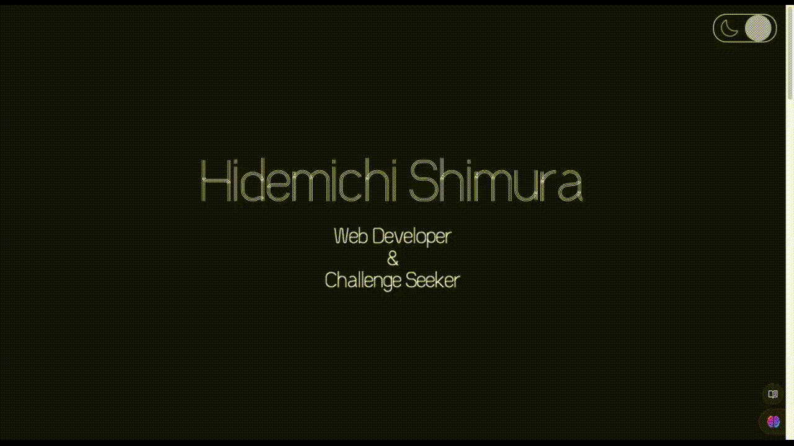

# Portfolio

My personal portfolio web page developed by modern frontend technologies as Next.js, Tailwind. Frontend testing was introduced by Storybook and Jest.

## Tech Stack

   
  
  
  
  
  

## Features

🧪 Components tested with Storybook and Jest
 
⚛️ Atomic Design
 
💡 Light/dark mode
 
📱 Responsive Design
 
🍱 Bento Layout

## Achievements

📄 UI documentation for refactoring and team-collaborating
 
⚛️ Atomic Design for reusable and well-structured components
 
💡 Light/dark mode toggle with React Context

## Author

[HidemichiShimura](https://github.com/HidemichiShimura)
