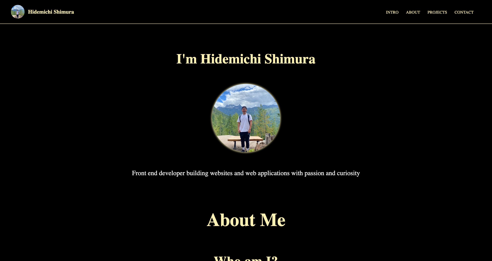
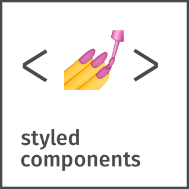

# **My Personal Portfolio Website**

 

## 📚**Table of Contents**

- [Description](#📖-description)
- [Built with](#🛠-built-with)
- [Achievements](#🏆-achievements)

 

## 📖 **Description**

This is my portfolio website developed with a combination of advanced web development technologies, including HTML, CSS, JavaScript, React, Next.js, and styled-components. It has been crafted with great care to ensure its full responsiveness across all devices and its optimization for search engine visibility, making it SEO friendly.

 

## 🛠 **Built with**

 
  
  
  
  
  
  

 

## 🏆 **Achievements**

- Modern front-end development with React and Next.js
- SEO Optimization with Next.js
- Utilization of CSS-in-JS with styled-components
